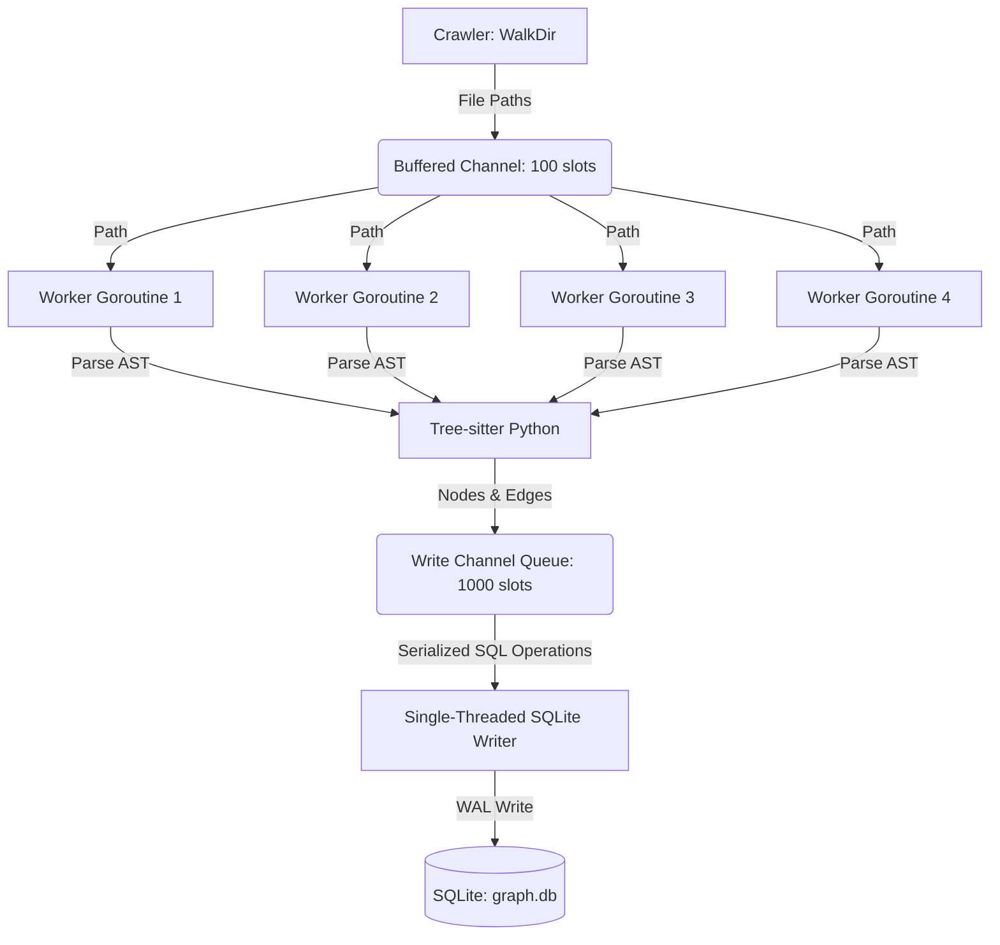

# CodeGraphContext MCP Server

CodeGraphContext is a high-performance, local Model Context Protocol (MCP) server written in Go. It dynamically crawls, parses, and indexes Python codebases into a queryable relational graph inside SQLite, exposing tools for AI agents to inspect call hierarchies and function dependencies in real-time.

---

## 1. System Architecture & Design

The application is structured around a concurrent **Producer-Consumer pipeline** that maps files to AST structures and outputs them to SQLite.



### Relational Schema (SQLite)
The call graph is stored using a simple, index-optimized relational schema:

```sql
-- Represents code entities (functions, classes, files)
CREATE TABLE IF NOT EXISTS nodes (
    id TEXT PRIMARY KEY,       -- Format: filepath:functionName or abstract:functionName
    type TEXT NOT NULL,        -- 'function', 'class', 'file'
    name TEXT NOT NULL,        -- Pure name (e.g. 'scatter')
    file_path TEXT NOT NULL,   -- Absolute OS file path
    start_byte INTEGER,        -- Exact AST byte offset start
    end_byte INTEGER           -- Exact AST byte offset end
);

-- Represents directed relationships (e.g., caller calls callee)
CREATE TABLE IF NOT EXISTS edges (
    source_id TEXT NOT NULL,   -- Caller function ID
    target_id TEXT NOT NULL,   -- Callee function ID
    type TEXT NOT NULL,        -- Relationship type (e.g., 'calls')
    PRIMARY KEY (source_id, target_id, type),
    FOREIGN KEY (source_id) REFERENCES nodes(id) ON DELETE CASCADE,
    FOREIGN KEY (target_id) REFERENCES nodes(id) ON DELETE CASCADE
);

CREATE INDEX IF NOT EXISTS idx_nodes_file_path ON nodes(file_path);
CREATE INDEX IF NOT EXISTS idx_edges_target ON edges(target_id);
```

---

## 2. Key Design Decisions

### Go Concurrency Model (Channels over Mutexes)
* **Design Decision:** We use Go's native channels (`chan`) to pipeline file paths from the directory walker (producer) to a pool of 4 concurrent worker goroutines (consumers).
* **Rationale:** Spawning a goroutine per file creates too much thread scheduling overhead on large codebases. A fixed-size worker pool (4 threads) matches the CPU cores of modern local machines, preventing thread thrashing while maximizing CPU utilization.

### Single-Threaded SQLite Writer Queue
* **Design Decision:** All database write queries (`UpsertNode` and `UpsertEdge`) are marshaled into parameterless function closures (`func()`) and routed through a single channel queue (`writeChan`) consumed by a single background writer thread.
* **Rationale:** SQLite is fundamentally a single-writer database. Parallel writes from multiple worker threads create write-lock collisions, returning `SQLITE_BUSY` (database is locked) and causing silent data loss. Spawning a single dedicated writer thread guarantees sequential, collision-free writes.

### AST Queries + Parent AST Traversal
* **Design Decision:** Instead of matching complex parent-child scopes inside the Tree-sitter query itself (which is highly fragile and fails on nested conditional blocks, loops, or exception statements), we:
  1. Use simple queries to find all call nodes.
  2. Walk up the AST parent pointers (`node.Parent()`) in Go until we hit a `function_definition` node, extracting the containing function's name programmatically.
* **Rationale:** Programmatic parent-walking is 100% reliable and guarantees we find the caller function regardless of how deeply nested the call is inside the function body.

---

## 3. Encountered Issues & Resolutions

### Case Study 1: Stdio Pollution & JSON-RPC Corruption
* **Symptoms:** The IDE returned `invalid character 'S' looking for beginning of value` and crashed during initialization.
* **Root Cause:** In `main.go`, we logged progress logs using standard `fmt.Printf("Starting scan of...")` which writes to `os.Stdout`. Because the MCP protocol uses `os.Stdout` exclusively for JSON-RPC communication, these raw prints corrupted the communication stream, crashing the IDE's client parser.
* **Resolution:** Replaced all print statements in the crawler and parser with `fmt.Fprintf(os.Stderr, ...)` or standard Go `log.Printf`. Standard error is safely captured by the IDE's log consoles without touching the JSON-RPC stream.

### Case Study 2: Root Directory Permission Crashes
* **Symptoms:** The server crashed on startup with `unable to open database file (14) : calling "initialize": EOF`.
* **Root Cause:** Opening the database relative to the working directory (`storage.NewDB("graph.db")`) failed because the IDE launches global MCP background processes with the CWD set to the system root `/`, which is write-protected under macOS System Integrity Protection (SIP).
* **Resolution:** Moved database initialization inside the MCP tool callback, dynamically resolving the database path using the target codebase folder (`filepath.Join(projectPath, "graph.db")`). The server now boots globally in a clean, dormant state and only writes databases inside writable workspace folders.

### Case Study 3: Asynchronous Read-Before-Write Race Condition
* **Symptoms:** The first call to `get_callers` on a codebase returned `No callers found`, but subsequent manual checks in the SQLite file showed the data was there.
* **Root Cause:** `GetCallers()` executed immediately after `crawlAndParse` returned. However, because database writes were processed asynchronously in the background queue, the query ran on an empty or partially populated database before the queue could finish draining. The connection was only closed (draining the queue) at the end of the tool invocation.
* **Resolution:** Added a `Flush()` method to the database using `sync.WaitGroup`. Immediately after the crawling function returns, the server calls `db.Flush()`, blocking the handler thread until the background writer finishes executing every single queued write.

### Case Study 4: Missing Method Callers (`self.win_exists()`)
* **Symptoms:** Querying callers of `win_exists` returned `No callers found` despite being called multiple times inside `visdom`.
* **Root Cause:** The parser query was configured as `(call function: (identifier) @callee)`. In Python, a method call like `self.win_exists()` parses as an `(attribute)` node where the actual function identifier is nested inside `attribute: (identifier)`. The parser was ignoring all attribute-scoped method calls.
* **Resolution:** Updated the Tree-sitter query to use **alternation** to match both syntax structures:
  ```query
  (call
      function: [
          (identifier) @callee
          (attribute
              attribute: (identifier) @callee)
      ])
  ```
