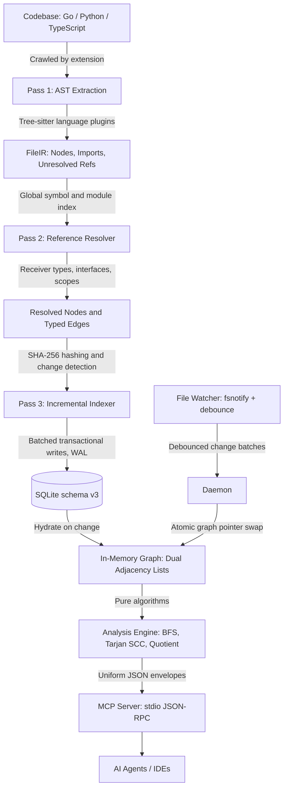

# graphContext

**A local code-graph reasoning engine for AI coding agents, written in Go.**

[](https://go.dev)
[](https://modelcontextprotocol.io)
[](LICENSE.txt)

`graphContext` is a Model Context Protocol (MCP) server that indexes **Go**, **Python**, and **TypeScript/JavaScript** codebases into a queryable relational graph, then exposes deterministic graph reasoning as tools an agent can call — blast radius, call traces, dependency paths, circular dependencies, dead code, affected tests, and architecture maps.

Everything runs locally. No embeddings, no network calls, no vector database.

---

## Why

AI agents burn context window rediscovering structure that can be known statically. Asking "what breaks if I change this function?" by grepping and reading files is expensive, slow, and probabilistic. `graphContext` splits the work:

* **The graph computes.** Deterministic algorithms answer structural questions exactly.
* **The LLM explains.** The agent receives compact JSON with exact file and line provenance.

The same repository state always yields byte-identical answers.

---

## Quickstart

### Install

```bash
go install github.com/vedansh-5/graphcontext@latest
```

Or build from source:

```bash
git clone https://github.com/vedansh-5/graphContext.git
cd graphContext
go build -o graphcontext main.go
```

### Connect to an MCP client

The server speaks JSON-RPC over stdio and takes no CLI flags — each tool receives an absolute `project_path`, so one server instance can serve many repositories.

**Claude Code:**

```bash
claude mcp add graphcontext -- /absolute/path/to/graphcontext
```

**Claude Desktop / any client using `mcpServers` config:**

```json
{
  "mcpServers": {
    "graphcontext": {
      "command": "/absolute/path/to/graphcontext"
    }
  }
}
```

On the first tool call against a repository, the indexer performs a full three-pass parse. Subsequent calls hash file contents and re-parse only what changed.

Indexes live in `~/.cache/graphcontext/<repo_hash>/graph.db`, never inside the analyzed repository.

---

## Tools

Every tool returns a uniform envelope, so callers parse one shape:

```json
{
  "answer":  { "...structured facts..." },
  "caveats": ["...honest confidence disclosures..."],
  "stats":   { "nodes_evaluated": 120, "truncated": false }
}
```

All tools take `project_path` as the first argument.

| Tool | Purpose |
|---|---|
| `search_symbols(query, kind?, limit?)` | FTS5 symbol search with subword tokenization (camelCase, snake_case, dotted) and in-memory substring fallback. |
| `get_context(symbol, radius?, include_source?)` | Context pack for one symbol: definition site, callers, callees, inheritance, optional source slice. |
| `get_task_context(task, limit?)` | Takes a natural-language task, scores seed symbols, expands neighborhoods, returns a bounded context pack. |
| `impact_of_change(symbol, change_type?, max_depth?, limit?)` | Blast radius of modifying or deleting a symbol: transitive callers, affected tests, dangling references. |
| `trace(from, to?, direction?, max_depth?, limit?)` | Forward call tree with recursion markers, or enumerated call paths between two symbols. |
| `repo_overview(analysis?, level?, top?)` | Module quotient graph with a generated Mermaid diagram, Tarjan SCC cycles, dead-code candidates, coupling metrics. |
| `diff_impact(diff? \| git_ref? \| staged?, rule_file?)` | Maps a git diff onto AST symbols, then selects the minimal reaching test set and flags architectural boundary violations. |

---

## Architecture


```mermaid
graph TD
    A[Codebase: Go / Python / TypeScript] -->|Crawled by extension| B[Pass 1: AST Extraction]
    B -->|Tree-sitter language plugins| C[FileIR: Nodes, Imports, Unresolved Refs]
    C -->|Global symbol and module index| D[Pass 2: Reference Resolver]
    D -->|Receiver types, interfaces, scopes| E[Resolved Nodes and Typed Edges]
    E -->|SHA-256 hashing and change detection| F[Pass 3: Incremental Indexer]
    F -->|Batched transactional writes, WAL| G[(SQLite schema v3)]
    G -->|Hydrate on change| H[In-Memory Graph: Dual Adjacency Lists]
    H -->|Pure algorithms| I[Analysis Engine: BFS, Tarjan SCC, Quotient]
    I -->|Uniform JSON envelopes| J[MCP Server: stdio JSON-RPC]
    J --> K[AI Agents / IDEs]
    L[File Watcher: fsnotify + debounce] -->|Debounced change batches| M[Daemon]
    M -->|Atomic graph pointer swap| H
```

### Pass 1 — Multi-language AST parsing (`pkg/lang`)

Language-neutral IR (`FileIR`, `ImportRef`, `Ref`, `TypeFacts`) extracted via Tree-sitter:

* **Go** (`pkg/lang/golang`) — functions, methods, receiver types, struct fields, interface method sets, imports, calls.
* **Python** (`pkg/lang/python`) — functions, classes, methods, decorators, inheritance, type annotations, constructors.
* **TypeScript/JavaScript** (`pkg/lang/typescript`) — functions, classes, interfaces, type aliases, class fields, imports/re-exports, `new` instantiations.

### Pass 2 — Cross-file reference resolution (`pkg/resolver`)

* Global symbol and module tables map imports to concrete file and module nodes.
* Receiver type propagation resolves calls on `self`, `this`, `super`, local variables, and selector chains (`r.db.Query()`).
* Structural interface satisfaction via method-set subset matching (Go and TypeScript duck typing).
* Every edge carries an explicit confidence tier: `exact`, `ambiguous`, `name_match`, or `unknown`.

### Pass 3 — Incremental hash indexing (`pkg/indexer`)

`EnsureFresh` compares SHA-256 content hashes against indexed state. Unchanged files are skipped entirely; modified files are re-parsed and updated inside a single transaction; deleted files cascade-delete their nodes and edges.

### Storage (`pkg/store`)

SQLite schema v3 — `nodes`, `edges`, `files`, `metadata` — with foreign key constraints and WAL mode. Write-time subword tokenization (`SplitIdentifier`) feeds FTS5 for fuzzy symbol lookup.

### Analysis engine (`pkg/analysis`)

A bidirectional in-memory graph (`In` / `Out` adjacency lists) hydrated from SQLite. Algorithms run in Go memory rather than as recursive SQL CTEs:

| Function | What it does |
|---|---|
| `ReverseReach` | Layered BFS over incoming edges — impact sets and blast radius. |
| `ForwardReach` | Layered BFS over outgoing edges — dependency analysis. |
| `Trace` | Forward call tree with cycle detection and depth/breadth budgets. |
| `Neighborhood` | Subgraph extraction around seed nodes. |
| `PathsBetween` | Multi-hop call path enumeration with line numbers. |
| `SCCs` | Tarjan's algorithm for circular dependency detection. |
| `DeadCandidates` | Multi-source BFS from roots (`main`, tests, routes) for unreachable code. |
| `Condense` | Module quotient graph with coupling weights and Mermaid generation. |

### Change intelligence (`pkg/diff`, `pkg/testselect`, `pkg/archlint`)

* **`pkg/diff`** — parses unified diff hunks and intersects changed line ranges with AST node spans to classify symbols as `added`, `modified`, or `deleted`.
* **`pkg/testselect`** — runs `ReverseReach` from changed symbols across `calls`, `inherits`, and `overrides` edges to find reaching tests, ranked by call-graph distance and edge confidence. Reports the repo-wide test reduction percentage.
* **`pkg/archlint`** — declarative `RuleSet` / `ForbiddenRule` / `LayerRule` definitions loaded from JSON, enforced either across the whole graph or scoped to edges introduced by a diff.

### Live daemon (`pkg/watcher`, `pkg/daemon`)

* **`pkg/watcher`** — recursive `fsnotify` watcher with dynamic subdirectory discovery, a sliding-window debouncer that coalesces create/modify/delete events, and path filters for VCS directories, virtualenvs, and build artifacts.
* **`pkg/daemon`** — long-running coordinator that reacts to debounced batches, re-indexes incrementally, and publishes a rebuilt graph via an atomic pointer swap under `sync.RWMutex`. Readers never observe a partial graph.

---

## Design decisions

**Indexes live outside the repository.** Database files inside an analyzed repo pollute working trees, dirty `git status`, and trigger the file watcher in a feedback loop. Everything goes to `~/.cache/graphcontext/<repo_hash>/graph.db`.

**Dual-layer storage: SQLite for durability, in-memory adjacency lists for traversal.** Tarjan's SCC, multi-depth BFS, and quotient graphs are expensive as recursive CTEs but take milliseconds over Go maps. The in-memory graph is lazily reloaded only when `EnsureFresh` reports a hash difference.

**Two-pass resolution instead of single-pass.** Parsers emit IR with unresolved `Ref`s; resolution runs globally after all files are parsed. This removes parse-order dependencies and makes circular imports, method receivers, and cross-package references resolvable with full type awareness.

**Strict stdio isolation.** `os.Stdout` is reserved exclusively for JSON-RPC framing. Every log line, progress notice, and diagnostic goes to `os.Stderr` — a single stray `fmt.Printf` corrupts the protocol stream and disconnects the client.

**Deterministic output.** Go randomizes map iteration order, so every slice derived from a map or set is sorted before it reaches a response. Confidence tiers are surfaced as caveats rather than hidden behind a guess.

---

## Development

```bash
go test ./...                     # full suite
go test -v ./pkg/mcp_server/...   # MCP server end-to-end tests
go build -o graphcontext main.go  # build
```

Contribution conventions — small sequential PRs, signed-off commits, squash merges, `progress.md` updated per PR — are documented in [`instructions.md`](instructions.md). Milestone history lives in [`progress.md`](progress.md).

---

## Roadmap

| Milestone | Status |
|---|---|
| M0 — Storage, language layer, resolver, incremental indexer | Done |
| M1 — In-memory analysis engine and core MCP tools | Done |
| M2 — Change intelligence: diff mapping, test selection, arch linting | Done |
| M3 — Daemon and live file watcher | In progress |
| M4 — Validation: token-cost and resolver accuracy benchmarks | Planned |
| M5 — Research artifact: mutation-derived agent evaluation | Planned |

---

## Engineering notes

<details>
<summary>Four bugs worth remembering</summary>

**JSON-RPC stream corruption.** The client failed with `invalid character 'S' looking for beginning of value`. Early logging used `fmt.Printf`, writing plain text into the stream where the client expected JSON-RPC frames. Fixed by routing every diagnostic through `fmt.Fprintf(os.Stderr, ...)`.

**Root directory permission crash on macOS.** The server died with `unable to open database file (14) : EOF`. The IDE launched the MCP process with its working directory set to `/`, which is write-protected under System Integrity Protection. Fixed by resolving cache paths through `os.UserCacheDir()` in `store.CachePathFor`.

**Read-before-write race.** Tools returned `No callers found` on first scan even though the data appeared moments later. Asynchronous writer queues hadn't flushed before reads dispatched. Fixed with synchronous batch transactions plus an `EnsureFresh` barrier before query dispatch.

**Dropped Python method calls.** Callers of `self.win_exists()` were invisible. The Tree-sitter query only matched `(call function: (identifier) @callee)`, but Python method calls are attribute nodes. Fixed by adding a query alternation for `(attribute attribute: (identifier) @callee)`.

</details>

---

## License

[Apache 2.0](LICENSE.txt)
