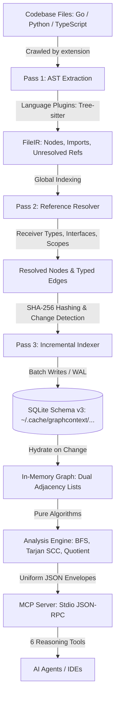

# graphContext — Graph Reasoning Engine for AI Software Engineers

`graphContext` is a high-performance, local Model Context Protocol (MCP) server written in Go. It dynamically indexes multi-language codebases (**Go**, **Python**, and **TypeScript/JavaScript**) into a queryable relational graph and in-memory analysis engine, exposing deterministic graph reasoning tools for AI coding agents (Claude, GPT, Gemini, local models).

---

## 1. System Architecture & Philosophy

AI agents waste context window capacity rediscovering code structure that can be statically known. `graphContext` inverts this division of labor:
* **The Graph Computes**: Deterministic algorithms calculate blast radii, call trees, dependency paths, circular dependencies, dead code, and module architecture maps.
* **The LLM Explains**: The agent receives compact, structured JSON carrying exact file and line provenance.


```mermaid
graph TD
    A[Codebase Files: Go / Python / TypeScript] -->|Crawled by extension| B[Pass 1: AST Extraction]
    B -->|Language Plugins: Tree-sitter| C[FileIR: Nodes, Imports, Unresolved Refs]
    C -->|Global Indexing| D[Pass 2: Reference Resolver]
    D -->|Receiver Types, Interfaces, Scopes| E[Resolved Nodes & Typed Edges]
    E -->|SHA-256 Hashing & Change Detection| F[Pass 3: Incremental Indexer]
    F -->|Batch Writes / WAL| G[(SQLite Schema v3: ~/.cache/graphcontext/...)]
    G -->|Hydrate on Change| H[In-Memory Graph: Dual Adjacency Lists]
    H -->|Pure Algorithms| I[Analysis Engine: BFS, Tarjan SCC, Quotient]
    I -->|Uniform JSON Envelopes| J[MCP Server: Stdio JSON-RPC]
    J -->|6 Reasoning Tools| K[AI Agents / IDEs]
```

---

## 2. Core Architectural Layers

### Pass 1: Multi-Language AST Parsing (`pkg/lang`)
* Language-neutral intermediate representation (`FileIR`, `ImportRef`, `Ref`, `TypeFacts`).
* Extracted via Tree-sitter for:
  * **Go** (`pkg/lang/golang`): Functions, methods, receiver types, struct fields, interface method sets, imports, and calls.
  * **Python** (`pkg/lang/python`): Functions, classes, methods, decorators, inheritance, type annotations, and constructors.
  * **TypeScript/JavaScript** (`pkg/lang/typescript`): Functions, classes, interfaces, type aliases, class fields, imports/re-exports, and `new` instantiations.

### Pass 2: Cross-File Reference Resolver (`pkg/resolver`)
* Multi-file symbol and module table mapping imports to concrete file and module nodes.
* Receiver type propagation resolves method calls on `self`, `this`, `super`, local variables, and selector chains (e.g. `r.db.Query()`).
* Structural interface satisfaction matching method sets (Go and TypeScript duck typing).
* Explicit edge confidence tiers: `exact`, `ambiguous`, `name_match`, or `unknown`.

### Pass 3: Incremental Hash Indexer (`pkg/indexer`)
* `EnsureFresh` coordinator computes SHA-256 content hashes of files against indexed states in SQLite.
* Unchanged files are bypassed completely.
* Modified files are re-parsed and atomically updated inside SQLite transactions.
* Deleted files trigger automatic cascading deletions of owned nodes and edges.

### Storage Engine: Schema v3 & FTS5 (`pkg/store`)
* Database files are stored externally in `~/.cache/graphcontext/<hash>/graph.db` to avoid repository clutter.
* SQLite schema v3 includes `nodes`, `edges`, `files`, and `metadata` tables with foreign key constraints and WAL mode.
* Write-time subword tokenization (`SplitIdentifier`) indexes camelCase, snake_case, and dotted symbols in FTS5 for fast fuzzy lookups.

### In-Memory Analysis Engine (`pkg/analysis`)
* Bidirectional in-memory graph (`In` and `Out` adjacency lists) loaded from SQLite on startup.
* Algorithms execute in memory rather than recursive SQL CTEs:
  * `ReverseReach`: Layered BFS over incoming edges for impact sets and blast radius.
  * `ForwardReach`: Layered BFS over outgoing edges for dependency analysis.
  * `Trace`: Forward execution call-tree with cycle detection and depth/breadth budgets.
  * `Neighborhood`: Subgraph extraction around seed nodes.
  * `PathsBetween`: Multi-hop call path enumeration with line numbers.
  * `SCCs`: Tarjan's Strongly Connected Components algorithm for circular dependency detection.
  * `DeadCandidates`: Multi-source BFS from roots (`main`, tests, routes) to find unreachable code.
  * `Condense`: Module-level quotient graph computing coupling weights and generating Mermaid architecture diagrams.

---

## 3. The 6 MCP Reasoning Tools

Every tool returns a uniform response envelope:
```json
{
  "answer": { "...structured facts..." },
  "caveats": ["...honest confidence disclosures..."],
  "stats": { "nodes_evaluated": 120, "truncated": false }
}
```

| Tool | Category | Description |
|---|---|---|
| `search_symbols(project_path, query, kind?, limit?)` | Orientation | Full-text FTS5 matching on symbol names with in-memory substring fallback. |
| `get_context(project_path, symbol, radius?, include_source?)` | Orientation | Context pack: definition site, callers, callees, inheritance hierarchy, and optional raw source slice. |
| `get_task_context(project_path, task, limit?)` | Context Engine | Analyzes a natural language task description, scores seed symbols, expands neighborhoods, and returns a bounded context pack. |
| `impact_of_change(project_path, symbol, change_type?, max_depth?, limit?)` | Change Reasoning | Calculates blast radius of modifying or deleting a symbol: transitive callers, affected test suites, and dangling references. |
| `trace(project_path, from, to?, direction?, max_depth?, limit?)` | Flow Reasoning | Traces forward execution call trees (with recursion markers) or finds execution call paths between two symbols. |
| `repo_overview(project_path, analysis?, level?, top?)` | Whole-Repo | Architectural overview: quotient graph with Mermaid diagram, Tarjan SCC circular dependencies, dead code candidates, and module coupling metrics. |

---

## 4. Key Design Decisions

### External Cache Storage
* **Decision**: All databases are saved to `~/.cache/graphcontext/<repo_hash>/graph.db`.
* **Rationale**: Placing database files inside analyzed repositories pollutes working trees, breaks git statuses, and triggers unwanted file watcher events.

### Dual-Layer Storage (SQLite + In-Memory Adjacency Lists)
* **Decision**: SQLite handles durable storage; graph algorithms operate on an in-memory dual adjacency graph (`In` and `Out` maps).
* **Rationale**: Recursive graph traversals (Tarjan's SCC, multi-depth BFS, quotient graphs) are computationally heavy as SQL CTEs but take milliseconds in Go memory. The in-memory graph is lazily reloaded only when `indexer.EnsureFresh` detects file hash differences.

### Two-Pass Reference Resolution
* **Decision**: Parsers emit language-neutral intermediate representations (`FileIR`) with unresolved references (`Ref`). Resolution runs globally across all parsed files in Pass 2.
* **Rationale**: Eliminates cross-file parsing order dependencies. Resolves circular imports, method receivers, and cross-package references with full type awareness.

### Stdio Stream Isolation
* **Decision**: Standard output (`os.Stdout`) is strictly dedicated to JSON-RPC framing. All log outputs, progress notices, and diagnostic traces are routed to `os.Stderr`.
* **Rationale**: Any non-JSON print to `os.Stdout` corrupts the MCP protocol stream and causes client disconnections.

---

## 5. Encountered Issues & Fixes

### 1. JSON-RPC Stream Corruption via `os.Stdout`
* **Issue**: The MCP client failed with `invalid character 'S' looking for beginning of value`.
* **Root Cause**: Early code used standard `fmt.Printf` for logging, writing raw text to stdout where the client expected JSON-RPC messages.
* **Fix**: Replaced all diagnostics across parsers, indexers, and servers with `fmt.Fprintf(os.Stderr, ...)`.

### 2. Root Directory Permission Crashes (macOS SIP)
* **Issue**: Server crashed with `unable to open database file (14) : EOF`.
* **Root Cause**: The IDE launched the MCP background process with the current working directory set to system root `/`, which is write-protected under macOS System Integrity Protection.
* **Fix**: Switched to `store.CachePathFor`, dynamically resolving cache directories under the user's home cache directory (`os.UserCacheDir()`).

### 3. Asynchronous Read-Before-Write Race Condition
* **Issue**: Calling tools returned `No callers found` on initial scans, but manual inspection showed data present later.
* **Root Cause**: Asynchronous background writer queues had not finished flushing before read queries executed.
* **Fix**: Implemented synchronous batch transactions in `pkg/store` combined with `EnsureFresh` verification before query dispatch.

### 4. Method Calls Dropped in AST Queries
* **Issue**: Function callers failed to capture method calls like `self.win_exists()`.
* **Root Cause**: Tree-sitter query only matched direct identifier calls `(call function: (identifier) @callee)`. In Python, method calls are attribute nodes `(attribute attribute: (identifier) @callee)`.
* **Fix**: Added query alternations to match both standalone identifiers and attribute accessors.

---

## 6. Development & Testing

```bash
# Run all tests across the repository
go test -v ./...

# Run MCP server tests specifically
go test -v ./pkg/mcp_server/...

# Build the executable
go build -o graphcontext main.go
```
